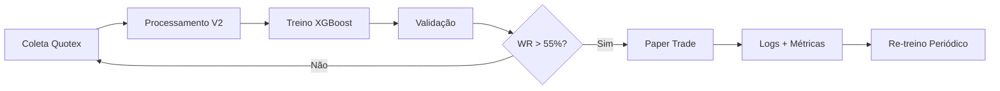

# Hermes Quant V2 🤖📈

Sistema automatizado de trading para **opções binárias** com modelos **XGBoost** treinados em dados **Quotex OTC**.

**Repositório:** https://github.com/contatoevertonoliveira/obs

---

## 📥 Instalação Rápida (Restore completo)

```bash
# 1. Clonar
git clone https://github.com/contatoevertonoliveira/obs.git
cd obs

# 2. Restore automático (faz TUDO!)
chmod +x restore.sh
./restore.sh
# ✅ Cria venv + instala dependências
# ✅ Verifica estrutura do projeto
# ✅ Dá instruções finais

# 3. Configurar credenciais Quotex
source venv_quotex/bin/activate
export QUOTEX_EMAIL="seu@email.com"
export QUOTEX_PASSWORD="sua_senha"

# 4. Rodar paper trade ao vivo!
python3 src/papertrade_quotex.py
```

---

## 📦 Estrutura do Projeto

| Pasta | Conteúdo | Tamanho |
|:---|---:|---:|
| `src/` | 38 scripts (coleta, treino, backtest, paper trade) | ~500KB |
| `config/` | Spreads calibrados + setups ativos + settings | ~36KB |
| `models/quotex_v2/` | **299 modelos XGBoost treinados** | **119MB** |
| `data/raw/quotex/` | **86 pares forex/cripto, 315k candles brutos** | **166MB** |
| `data/processed/quotex_v2/` | **86 CSVs com features + targets calibrados** | **289MB** |
| `backup_snapshot.json` | Snapshot completo com todas as métricas | ~4KB |
| `requirements.txt` | Dependências Python | ~100B |
| **Total** | **~523 arquivos** | **~575MB** |

---

## 🎯 Modelos Ativos (Paper Trade)

| Setup | Ativo | TF | Sinal | Threshold | WR | Trades Val. | Expectativa | Stake | Martingale |
|:---|---|:---:|:---:|:---:|:---:|:---:|:---:|:---:|:---:|
| **BNB M5 call_5** 🥇 | BNBUSD_otc | M5 | CALL 5 | 0.70 | **69.6%** | 23 | **+25.2%** | 2.0% | ✅ |
| **BRLUSD M1 put_5** 🥈 | BRLUSD_otc | M1 | PUT 5 | 0.70 | **63.6%** | 11 | **+14.5%** | 1.0% | ❌ |
| **BTC M15 call_1** 🥉 | BTCUSD_otc | M15 | CALL 1 | 0.70 | **63.2%** | 19 | **+13.7%** | 1.5% | ❌ |
| **GBPJPY M15 call_5** | GBPJPY_otc | M15 | CALL 5 | 0.70 | **62.1%** | 66 | **+11.8%** | 1.5% | ✅ |
| **LTC M15 call_1** | LTCUSD_otc | M15 | CALL 1 | 0.65 | **58.8%** | 17 | **+5.9%** | 1.0% | ❌ |

**Total: 5 modelos viáveis (expectativa positiva com th=0.7)**

---

## 📊 Pipeline Completo



### Scripts na ordem de execução:

```bash
# 1. Coleta de dados históricos
python3 src/collect_quotex_data.py        # 10 ativos principais
python3 src/collect_more_pairs.py         # +19 pares adicionais

# 2. Análise de volatilidade (calibra spreads)
python3 src/analyze_volatility.py

# 3. Processamento de features + targets calibrados
python3 src/process_quotex_v2_all.py

# 4. Treinamento dos modelos XGBoost
python3 src/train_quotex_v2.py

# 5. Backtest de validação
python3 src/backtest_quotex_models.py

# 6. Paper trade ao vivo (conta DEMO)
export QUOTEX_EMAIL="seu@email.com"
export QUOTEX_PASSWORD="sua_senha"
python3 src/papertrade_quotex.py
```

---

## ⚙️ Configurações

### Spreads Calibrados (`config/quotex_spreads.json`)

Os spreads são calibrados por volatilidade real de cada par+TF:

| Classe | Exemplo | M1 spread | M5 spread | M15 spread |
|:---|---|:---:|:---:|:---:|
| 🚀 Cripto | BTC | 0.00080 | 0.00080 | 0.00080 |
| 🇪🇺 Forex Major | EUR | 0.00032 | 0.00072 | 0.00131 |
| 🇬🇧 Forex Major | GBP | 0.00003 | 0.00007 | 0.00014 |
| 🇨🇭 Forex Major | CHF | 0.00032 | 0.00072 | 0.00126 |
| 🇨🇦 Forex Major | CAD | 0.00020 | 0.00048 | 0.00084 |

### Gestão de Risco

- **Stake máximo:** 2% por trade
- **Martingale:** 2 níveis (1x → 2.5x → 6x)
- **Cooldown:** 1 minuto entre re-entradas no mesmo setup
- **Scan:** 10 segundos entre varreduras completas

---

## 🔬 Limites da API Quotex (Conta Demo)

| Timeframe | Profundidade Máxima | Candles |
|:---|---:|---:|
| M1 | **3 dias** | ~4.300 |
| M5 | **14 dias** | ~4.000 |
| M15 | **30 dias** | ~2.900 |

> **Nota:** A API não retorna mais de ~6.000 candles por chamada.
> Períodos maiores que 30 dias exigem coleta incremental diária.

---

## 📋 Ambiente

- **Python:** 3.12+
- **Bibliotecas:** XGBoost, pandas, numpy, ta, joblib, scikit-learn, pyquotex
- **Corretora:** Quotex (Conta Demo)
- **Ativos:** 86 pares (cripto OTC + forex OTC + forex Normal)
- **Modelos:** 299 XGBoost (200 iterações, max_depth=5, scale_pos_weight)

---

## 🚀 Roadmap

- [x] Coleta de dados Quotex (86 pares)
- [x] Feature engineering com spreads calibrados
- [x] Treinamento XGBoost (299 modelos)
- [x] Backtest de validação
- [x] Paper trade ao vivo
- [ ] Coleta incremental diária (cron job)
- [ ] Re-treino periódico automático
- [ ] Suporte IQOption, PocketOption, Deriv
- [ ] Dashboard web interativo
- [ ] Modo Soros (multiplicadores 1.5x-3x)
- [ ] Meta: R$100 → R$50.000 em 4 ciclos

---

## 📞 Suporte

Dúvidas ou problemas? Author: **Everton Oliveira** — contatoevertonoliveira@gmail.com
