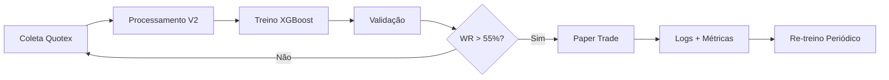

# Hermes Quant V2 🤖📈

Sistema automatizado de trading para **opções binárias** com modelos **XGBoost** treinados em dados **Quotex OTC**.

**Suporte a 4 exchanges:** Quotex • PocketOption • IQOption • Deriv

**Repositório:** https://github.com/contatoevertonoliveira/obs

---

## 📥 Instalação

### 🐧 Linux (Debian/Ubuntu — sua máquina de casa)

```bash
# 1. Clonar (573 MB com dados + modelos)
git clone https://github.com/contatoevertonoliveira/obs.git
cd obs

# 2. Restore automático (cria 4 venvs + instala TUDO)
chmod +x restore.sh
./restore.sh

# 3. Configurar credenciais
nano config/exchanges.env
# Preencha: email/senha Quotex, IQOption, token Deriv, SSID PocketOption

# 4. Ativar venv e rodar
source venv_quotex/bin/activate
python3 src/papertrade_quotex.py
```

### 🪟 Windows 11 Business (notebook)

**Pré-requisitos:**
1. **Python 3.12+** — Baixe em https://www.python.org/downloads/
   - ✅ Marque **"Add Python to PATH"** na instalação
2. **Git** — https://git-scm.com/download/win

```powershell
# 1. Clonar
git clone https://github.com/contatoevertonoliveira/obs.git
cd obs

# 2. Criar venvs manualmente (Windows não roda .sh)
python -m venv venv_quotex
python -m venv venv_pocket
python -m venv venv_iqoption
python -m venv venv_deriv

# 3. Instalar dependências (QUOTEX)
venv_quotex\Scripts\activate
pip install --upgrade pip
pip install xgboost pandas numpy ta joblib scikit-learn pyquotex

# 4. POCKETOPTION
venv_pocket\Scripts\activate
pip install --upgrade pip
pip install pandas numpy
pip install git+https://github.com/ByJhonesDev/PocketOptionAPI.git

# 5. IQOPTION
venv_iqoption\Scripts\activate
pip install --upgrade pip
pip install git+https://github.com/Lu-Yi-Hsun/iqoptionapi.git

# 6. DERIV
venv_deriv\Scripts\activate
pip install --upgrade pip
pip install websockets pandas numpy

# 7. Configurar credenciais
notepad config\exchanges.env
# Preencha: email/senha Quotex, IQOption, token Deriv, SSID PocketOption

# 8. Rodar paper trade
venv_quotex\Scripts\activate
python src\papertrade_quotex.py
```

---

## 📋 Ambiente

### 🐧 Linux Debian (casa)
| Item | Versão/Comando |
|------|---------------|
| **Python** | `sudo apt install python3.12 python3.12-venv` |
| **Git** | `sudo apt install git` |
| **Restore** | `./restore.sh` (automático) |

### 🪟 Windows 11 Business (notebook)
| Item | Download/Comando |
|------|-----------------|
| **Python** | https://www.python.org/downloads/ (3.12+) |
| **Git** | https://git-scm.com/download/win |
| **Restore** | Manual (passos acima) |

---

## 🔌 Exchanges Suportadas

| # | Exchange | Venv | Biblioteca | Autenticação |
|---|----------|------|-----------|-------------|
| 1 | **Quotex** | `venv_quotex` | `pyquotex` | email + senha |
| 2 | **PocketOption** | `venv_pocket` | `ByJhonesDev` | SSID (navegador) |
| 3 | **IQOption** | `venv_iqoption` | `Lu-Yi-Hsun` | email + senha |
| 4 | **Deriv** | `venv_deriv` | WebSocket oficial | PAT (API Token) |

### 🔑 Onde conseguir cada credencial

| Exchange | Onde pegar |
|----------|-----------|
| **Quotex** | https://quotex.io — login email/senha (DEMO) |
| **PocketOption** | F12 → Network → WS → copiar `42["auth",{...}]` |
| **IQOption** | https://iqoption.com — login email/senha (DEMO) |
| **Deriv** | https://app.deriv.com → Settings → API Token → Create (escopo: Read + Trade) |

---

## 📦 Estrutura do Projeto

| Pasta | Conteúdo |
|:---|---:|
| `src/` | Scripts (coleta, treino, backtest, paper trade, integrações) |
| `config/` | Spreads calibrados + setups ativos + credenciais (.env) |
| `models/quotex_v2/` | **299 modelos XGBoost treinados** |
| `data/raw/quotex/` | **86 pares forex/cripto, 315k candles brutos** |
| `data/processed/quotex_v2/` | **86 CSVs com features + targets calibrados** |
| `backup_snapshot.json` | Snapshot completo com métricas |
| **Total** | **~575 MB** |

### Scripts de integração

| Arquivo | Função |
|---------|--------|
| `src/papertrade_quotex.py` | Paper trade ao vivo Quotex |
| `src/quotex_integration.py` | Classe Quotex |
| `src/pocketoption_integration.py` | Classe PocketOption |
| `src/iqoption_integration.py` | Classe IQOption |
| `src/deriv_integration.py` | Classe Deriv |

---

## 🎯 Modelos Ativos (Paper Trade)

| Setup | Ativo | TF | Sinal | WR | Trades | Expectativa | Stake | Martingale |
|:---|---|:---:|:---:|:---:|:---:|:---:|:---:|:---:|
| **BNB M5 call_5** 🥇 | BNBUSD_otc | M5 | CALL 5 | **69.6%** | 23 | **+25.2%** | 2.0% | ✅ |
| **BRLUSD M1 put_5** 🥈 | BRLUSD_otc | M1 | PUT 5 | **63.6%** | 11 | **+14.5%** | 1.0% | ❌ |
| **BTC M15 call_1** 🥉 | BTCUSD_otc | M15 | CALL 1 | **63.2%** | 19 | **+13.7%** | 1.5% | ❌ |
| **GBPJPY M15 call_5** | GBPJPY_otc | M15 | CALL 5 | **62.1%** | 66 | **+11.8%** | 1.5% | ✅ |
| **LTC M15 call_1** | LTCUSD_otc | M15 | CALL 1 | **58.8%** | 17 | **+5.9%** | 1.0% | ❌ |

---

## ⚙️ Gestão de Risco

- **Stake máximo:** 2% por trade
- **Martingale:** 2 níveis (1x → 2.5x → 6x) nos setups principais
- **Cooldown:** 1 minuto entre re-entradas no mesmo setup
- **Scan:** 10 segundos entre varreduras completas

---

## 🚀 Pipeline



### Scripts na ordem

```bash
# 1. Coleta de dados históricos
python3 src/collect_quotex_data.py        # 10 ativos principais
python3 src/collect_more_pairs.py         # +19 pares adicionais

# 2. Análise de volatilidade
python3 src/analyze_volatility.py

# 3. Processamento de features
python3 src/process_quotex_v2_all.py

# 4. Treinamento dos modelos
python3 src/train_quotex_v2.py

# 5. Backtest
python3 src/backtest_quotex_models.py

# 6. Paper trade ao vivo
source venv_quotex/bin/activate     # Linux
# venv_quotex\Scripts\activate      # Windows
python3 src/papertrade_quotex.py
```

---

## 📞 Suporte

**Autor:** Everton Oliveira — contatoevertonoliveira@gmail.com
**GitHub:** https://github.com/contatoevertonoliveira/obs
